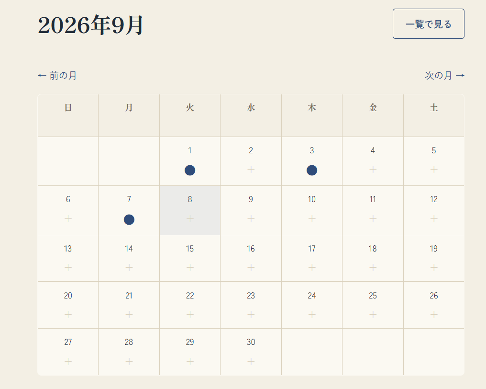
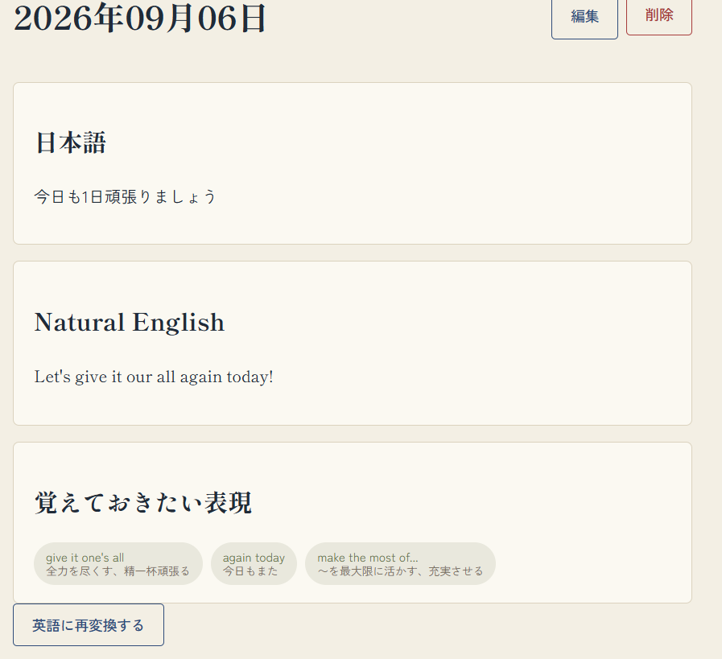
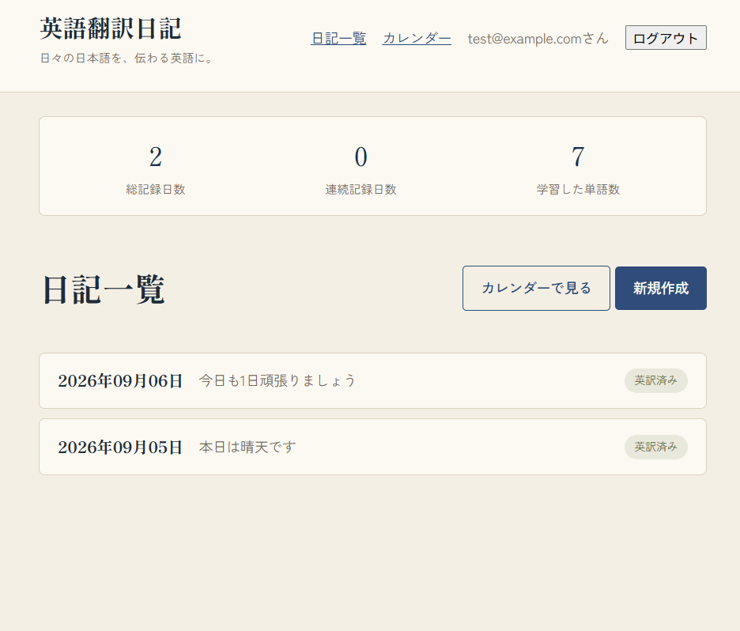
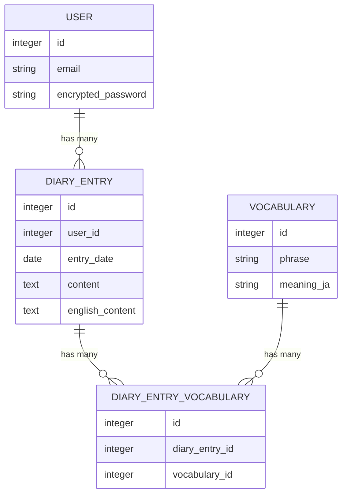

# 英語翻訳日記 - AI日記英語学習アプリ

## サービス概要
日本語で書いた日記を、AIが自然な英語に変換してくれる日記アプリです。

##  サービス画像

| カレンダー画面 | 日記詳細（AI変換後） |日記一覧画面 |
|---|---|---|
|  |  |  |

## 使い方

1. 新規登録してログインする
2. 「新規作成」から、その日の出来事を日本語で書いて保存する
3. 日記詳細画面で「AIで英語に変換する」を押すと、自然な英語に変換される（数秒後にページを更新が必要）
4. 変換結果の中から、覚えておきたい単語・フレーズが自動で抽出され、日記に紐づいて表示される
5. カレンダー画面から、過去の記録を日付ベースで振り返れる。記録がある日には「●」、まだ書いていない日には「＋」が表示されます

## なぜこれを作ったか

日記を書く習慣があったので、それをそのまま英語学習の教材にできないかと考えたのがきっかけです。直訳ではなく自然な英語への変換にこだわり、そこで出てきた表現を後から復習できる単語帳も合わせて作りました。

## 工夫したところ

- **AI連携とバックグラウンド処理**：Gemini APIを使い、「自然な英訳」と「学習に役立つ単語の抽出」を1回のリクエストで同時に行うようにプロンプトを設計しました。また、API呼び出しをリクエスト内で同期処理すると画面の応答が遅くなるため、ActiveJobを使ってバックグラウンド処理化し、体感速度を落とさない設計にしています
- **セキュリティ（IDOR対策）**：どのコントローラーアクションも`current_user.diary_entries`を起点にデータを取得するようにし、他人の日記IDを直接指定してもアクセスできないようにしています。この挙動はリクエストスペックでも保証しています
- **単語の重複管理**：同じ単語が複数の日記で登場しても、単語帳としては1件にまとめる設計にしています（`Vocabulary`と`DiaryEntry`を中間テーブルで多対多に接続し、`find_or_create_by`で重複作成を防止）

## ER図

## 使用技術

Ruby on Rails / SQLite（開発） / PostgreSQL（本番） / Devise / Gemini API / RSpec